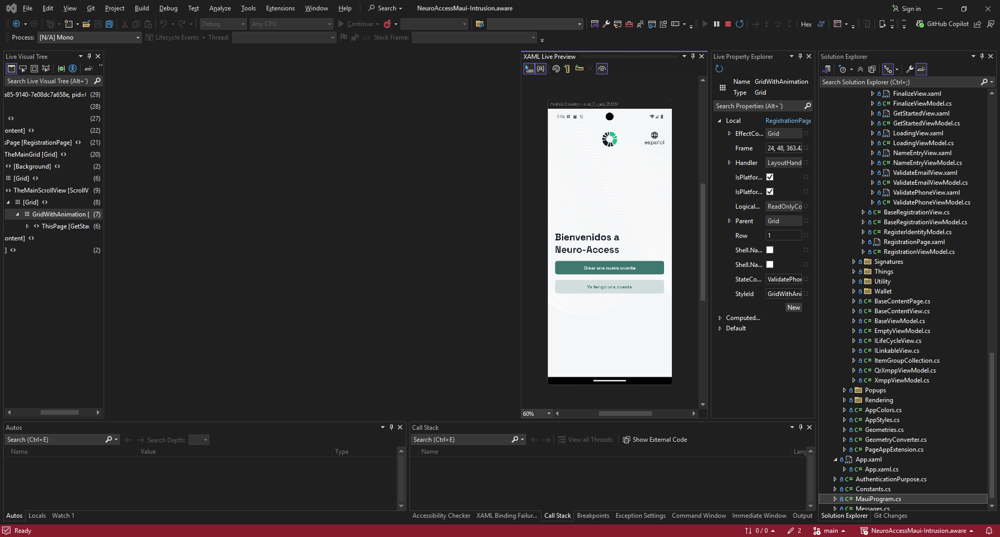
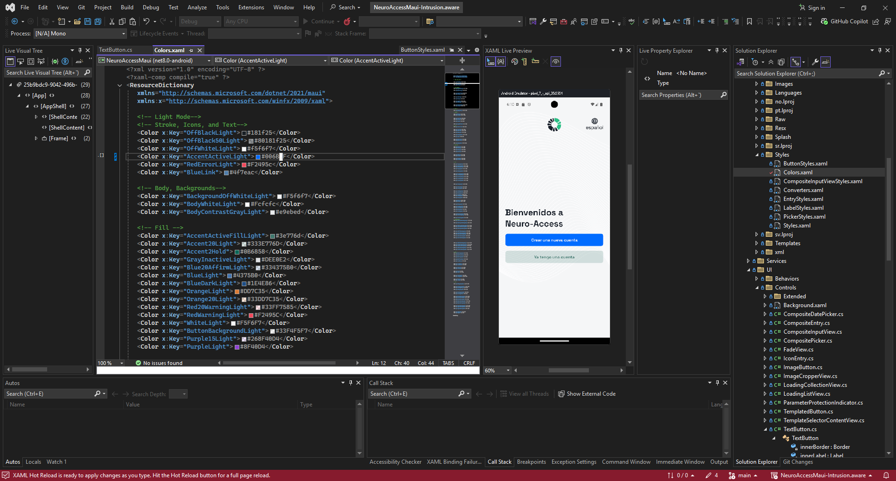

# Como modificar la APP Neuro Access

Neuro access esta estructurada como cualquier app de Maui en C#. Si explorar el codigo fuente de la app, notaras que hay una gran cantidad de archivos con extension XAML. XAML es un markup language que se utiliza para definir interfaces de usuario en aplicaciones de .NET. El entry point de la app se encuentra en `NeuroAccessMaui/App.xaml`, aca se definen los puntos de entrada de la app y se inicializan los servicios necesarios para que la app funcione correctamente.

Si deseas modificar la applicacion, no estaras interesado en modificar los archivos `.cs` ya que estos son codigos en C# que definen la logica de la app pero no su estilo. Si deseas modificar el estilo de la app, deberas modificar los archivos `.xaml` que se encuentran en la carpeta `NeuroAccessMaui/Views`. Estos archivos definen la interfaz de usuario de la app y son los que deberas modificar si deseas cambiar el estilo de la app.

Si solo deseas modificar los colores o cosas mas globales de los estilos, puedes modificar los archivos en `NeuroAccessMaui/Resources/Styles/*` ya que aca se definen los estilos globales que se utilizan en la app y que casi todos los archivos `xaml` importan y utilizan. 

# Ejemplo

Corre la app en visual studio siguiendo las instrucciones disponibles en el readme. 

Una vez ejecutada la app en un emulador, deberias poder algo similar a esto: 




Como puedes ver, hay un preview disponible a la derecha que te permite ver los cambios que haces en tiempo real. 

Ahora si vamos a el archivo `NeuroAccessMaui/Resources/Styles/Colors.xaml` podemos cambiar el valor de el tag `Color` con `x:Key="AccentActiveLight"` a un nuevo color como `#006bff`:

```xml
<Color x:Key="AccentActiveLight">#006bff</Color>
```
Si guardas los cambios, podras ver reflejado en tiempo real el cambio en el preview de la app. Si los cambios no se ven reflejados, puedes intentar reiniciar la app en el emulador.

